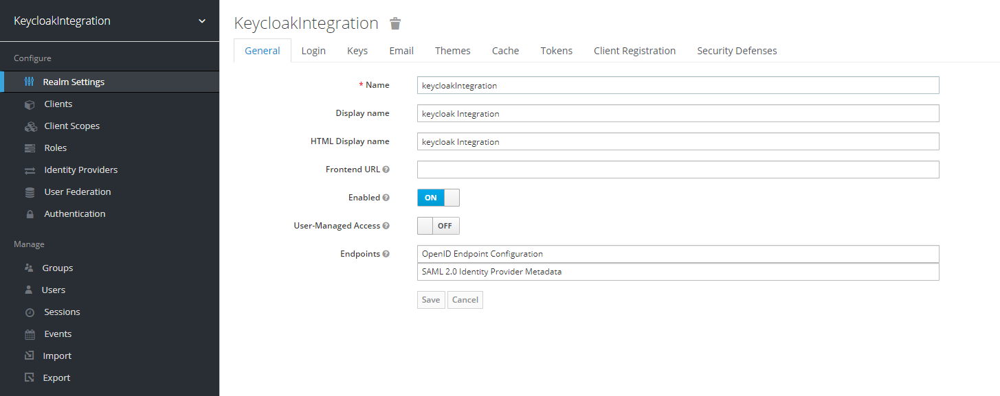
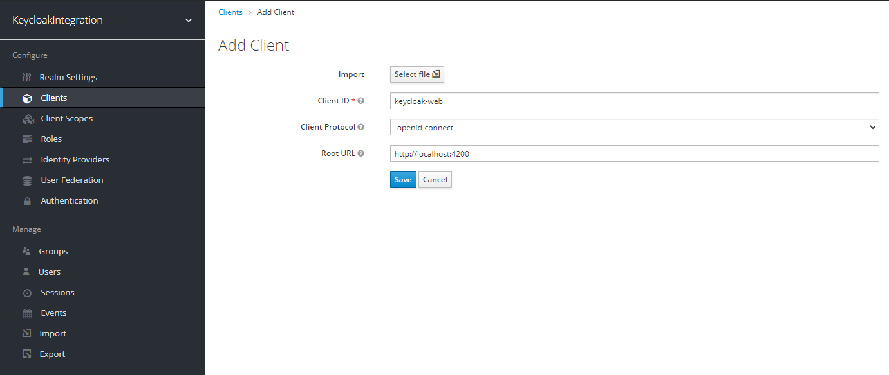
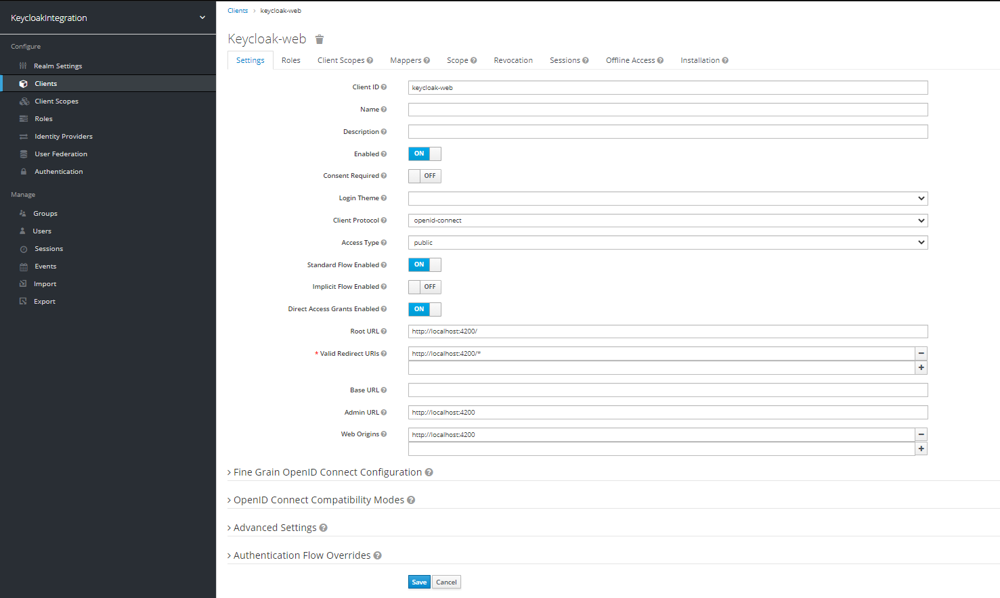

# Keycloak Integration with Angular

## versions

```markdown
keycloak: 10.0.2
Angular: 9
postgresql: 9.6-alpine
keycloak-angular: 7.3.1
keycloak-js: 8.0.1
```

**Note: If you are changing at least one version in above version list, probably you have to change other versions also.** 


## Setup Keycloak Server

### Run Keycloak

* Go the docker folder using terminal and execute below cmd

**_docker-compose -f keycloak-docker-compose.yml up_**

### Configure Keycloak

* [Create a Realm](https://www.keycloak.org/docs/latest/server_admin/index.html#_create-realm)

I create a realm call `keycloakIntegration` and after hit `create` button it will look like below.



* [Create a Client](https://www.keycloak.org/docs/latest/server_admin/index.html#_clients)

I create a client call `keycloak-web` and add your angular server(http://localhost:4200/) URL as a `Root URL` Then click `save` button.





* [Create a User](https://www.keycloak.org/docs/latest/server_admin/index.html#_create-new-user)

Create a user and add credentials.

## Run angular application

Execute Below cmd

* npm install
* ng serve -o

**Note: If you are change Realm name, client name or keycloak server port, Please make sure you correctly update those details in `app.module.ts`** 


## Reference 

[Keycloak Documentation](https://www.keycloak.org/docs/latest/server_admin/index.html)

[Keycloak-angular library documentation](https://www.npmjs.com/package/keycloak-angular)
